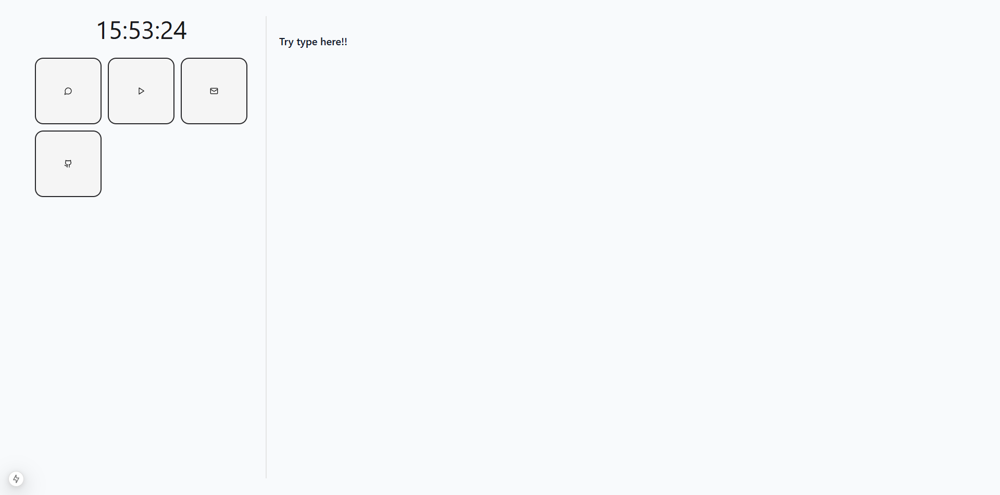
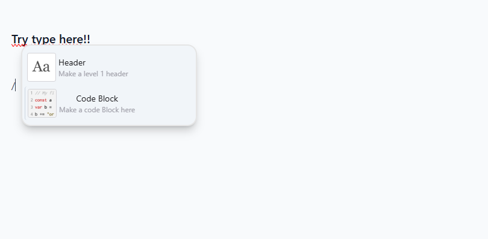

# 🧠 **Bob — Minimal & Customizable Start Page**

> **Bob** é uma página inicial simples, rápida e elegante para qualquer navegador.  
> Tome notas instantaneamente, salve-as no **armazenamento local** e comece o dia com foco.



---

## 🚀 **Recursos Principais**

- 🗒️ **Editor de notas instantâneo** — anotações salvas automaticamente no navegador.
- ⚡ **Atalhos de texto inteligentes** — digite `/` como no Notion para abrir comandos.
- 🧩 **Totalmente personalizável** — adapte o visual e o comportamento.
- 💾 **Sem conta ou backend** — tudo é salvo localmente.
- 🌐 **Compatível com qualquer navegador** — desktop ou mobile.
- 🎨 **Design minimalista e fluido** — foco total no que importa.

---

## 🧰 **Instalação e Uso**

### 🔗 1. Acesse o Bob
Abra:  
👉 [https://bob-webpage.vercel.app/](https://bob-webpage.vercel.app/)

### 🧭 2. Configure o Bob como sua página “Nova Guia”
Para isso, use a extensão **New Tab Redirect**:

#### 🧩 Passos:

1. **Instale a extensão**
   - [Chrome Web Store](https://chrome.google.com/webstore/)
   - [Firefox Add-ons](https://addons.mozilla.org/)
   - Busque por **“New Tab Redirect”** e instale.

2. **Configure a URL**
   - Abra as **configurações** da extensão (ícone → ⚙️ *Options*).
   - No campo “Redirect URL”, insira:
     ```
     https://bob-webpage.vercel.app/
     ```

3. **Salve e teste**
   - Clique em “Save”.
   - Abra uma nova aba — o Bob deve aparecer automaticamente.

---

## 🪄 **Atalhos e Comandos**

Digite `/` no editor para abrir o menu de atalhos, como no Notion.

Alguns exemplos:
- `/todo` → cria uma lista de tarefas.
- `/h1`, `/h2` → cria títulos.
- `/date` → insere a data atual.
- `/clear` → limpa a área de notas.



---

## 🧠 **Como Funciona**

Bob é 100% client-side.  
Tudo é armazenado no **Local Storage** do navegador — nada é enviado para servidores externos.

```text
┌────────────┐
│ Digite uma nota │
└──────┬─────┘
       ↓
🧠 Salvo automaticamente no navegador
```

---

## ⚙️ **Desenvolvimento**

Clone o repositório:

```bash
git clone https://github.com/gusata/Bob.git
cd Bob
npm install
npm run dev
```

Abra em:  
👉 `http://localhost:5173`

---

## 🧑‍💻 **Tecnologias Utilizadas**

- ⚛️ **React.js + Vite**
- 💅 **TailwindCSS**
- 🧠 **LocalStorage API**
- 🔤 **ContentEditable** para o editor leve
